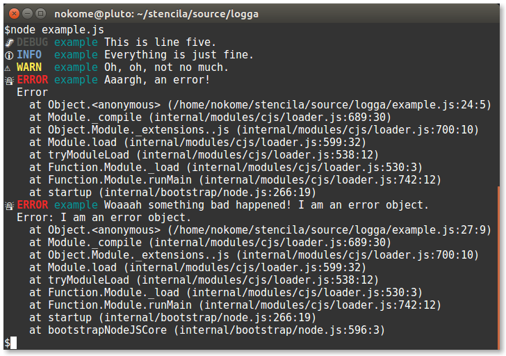

# Logga

🌲 Emit log events from anywhere. Consistently.

[](https://travis-ci.org/stencila/logga)
[](https://codecov.io/gh/stencila/logga)
[](https://www.npmjs.com/package/@stencila/logga)
[](https://stencila.github.io/logga/)

## Why?

We wanted to have a unified, consistent mechanism for emitting log event data across libraries. We wanted to decouple log event emission from log event consumption. We didn't want to have to pass `log` objects around everywhere. We wanted type safety. We wanted something lightweight.

## Approach

The approach used in `logga` is to use `process` (in Node) or `window` (in browsers) as a bus for log events. It's a simple approach, described in [this gist](https://gist.github.com/constantology/5f04d5782c1cc019722f), that combines emitting events using `process.emit()` or `window.dispatchEvent()` and registering log handlers as event listeners.

## Install

```bash
npm install --save @stencila/logga
```

## Usage

### Emitting log events

Create a new logger by calling `getLogger` with a unique tag to identify your app and/or module. Then emit log events using the `debug`, `info`, `warn` and `error` functions. You can pass them a message string or a `LogInfo` object.

```js
const { getLogger } = require('@stencila/logga')

const log = getLogger('example')

log.debug('This is line five.')
log.info('Everything is just fine.')
log.warn('Oh, oh, not no much.')
log.error('Aaargh, an error!')

try {
  throw new Error('I am an error object.')
} catch (error) {
  const { message, stack } = error
  log.error({
    message: 'Woaaah something bad happened! ' + message,
    stack,
  })
}
```

See [this post](https://reflectoring.io/logging-levels/) for advice on when to use the alternative log levels. In summary,

- The `ERROR` level should only be used when the application really is in trouble. Users are being affected without having a way to work around the issue.

- The `WARN` level should be used when something bad happened, but the application still has the chance to heal itself or the issue can wait a day or two to be fixed.

- The `INFO` level should be used to document state changes in the application or some entity within the application.

- The `DEBUG` level should be used to log any information that helps us identify what went wrong.

### Handling log events

The default log handler prints log data to `console.error`. If `stderr` is TTY log data is formatted for human consumption with emoji, colours and stack trace (for errors):



If `stderr` is not TTY log data is formatted for machine consumption (e.g. for log files) as [ndjson](http://ndjson.org/), with a time stamp, if `stderr` (for machine consumption e.g. log files):

```json
{"time":"2019-07-02T21:19:24.872Z","tag":"example","level":3,"message":"This is line five.","stack":"Error\n    at Object.<anonymous> (/home/nokome/stencila/source/logga/example.js:21:5)\n    at Module._compile (internal/modules/cjs/loader.js:689:30)\n    at Object.Module._extensions..js (internal/modules/cjs/loader.js:700:10)\n    at Module.load (internal/modules/cjs/loader.js:599:32)\n    at tryModuleLoad (internal/modules/cjs/loader.js:538:12)\n    at Function.Module._load (internal/modules/cjs/loader.js:530:3)\n    at Function.Module.runMain (internal/modules/cjs/loader.js:742:12)\n    at startup (internal/bootstrap/node.js:266:19)"}
{"time":"2019-07-02T21:19:24.875Z","tag":"example","level":2,"message":"Everything is just fine.","stack":"Error\n    at Object.<anonymous> (/home/nokome/stencila/source/logga/example.js:22:5)\n    at Module._compile (internal/modules/cjs/loader.js:689:30)\n    at Object.Module._extensions..js (internal/modules/cjs/loader.js:700:10)\n    at Module.load (internal/modules/cjs/loader.js:599:32)\n    at tryModuleLoad (internal/modules/cjs/loader.js:538:12)\n    at Function.Module._load (internal/modules/cjs/loader.js:530:3)\n    at Function.Module.runMain (internal/modules/cjs/loader.js:742:12)\n    at startup (internal/bootstrap/node.js:266:19)"}
{"time":"2019-07-02T21:19:24.875Z","tag":"example","level":1,"message":"Oh, oh, not no much.","stack":"Error\n    at Object.<anonymous> (/home/nokome/stencila/source/logga/example.js:23:5)\n    at Module._compile (internal/modules/cjs/loader.js:689:30)\n    at Object.Module._extensions..js (internal/modules/cjs/loader.js:700:10)\n    at Module.load (internal/modules/cjs/loader.js:599:32)\n    at tryModuleLoad (internal/modules/cjs/loader.js:538:12)\n    at Function.Module._load (internal/modules/cjs/loader.js:530:3)\n    at Function.Module.runMain (internal/modules/cjs/loader.js:742:12)\n    at startup (internal/bootstrap/node.js:266:19)"}
{"time":"2019-07-02T21:19:24.875Z","tag":"example","level":0,"message":"Aaargh, an error!","stack":"Error\n    at Object.<anonymous> (/home/nokome/stencila/source/logga/example.js:24:5)\n    at Module._compile (internal/modules/cjs/loader.js:689:30)\n    at Object.Module._extensions..js (internal/modules/cjs/loader.js:700:10)\n    at Module.load (internal/modules/cjs/loader.js:599:32)\n    at tryModuleLoad (internal/modules/cjs/loader.js:538:12)\n    at Function.Module._load (internal/modules/cjs/loader.js:530:3)\n    at Function.Module.runMain (internal/modules/cjs/loader.js:742:12)\n    at startup (internal/bootstrap/node.js:266:19)"}
{"time":"2019-07-02T21:19:24.875Z","tag":"example","level":0,"message":"Woaaah something bad happened! I am an error object.","stack":"Error: I am an error object.\n    at Object.<anonymous> (/home/nokome/stencila/source/logga/example.js:27:9)\n    at Module._compile (internal/modules/cjs/loader.js:689:30)\n    at Object.Module._extensions..js (internal/modules/cjs/loader.js:700:10)\n    at Module.load (internal/modules/cjs/loader.js:599:32)\n    at tryModuleLoad (internal/modules/cjs/loader.js:538:12)\n    at Function.Module._load (internal/modules/cjs/loader.js:530:3)\n    at Function.Module.runMain (internal/modules/cjs/loader.js:742:12)\n    at startup (internal/bootstrap/node.js:266:19)\n    at bootstrapNodeJSCore (internal/bootstrap/node.js:596:3)"}
```

See [`index.test.html`](index.test.html) for example usage in the browser.

You can register a new handler by calling `addHandler` with a handling function. Or use `replaceHandlers` to replace any existing log handlers (including the default). If you don't want any log handling at all, remove the default handler using `removeHandlers`.

Logga can be used with a log handling library e.g. Winston, Pino.

```javascript
// In library, create a named logger
const logger = getLogger('encoda')
```

```javascript
// Handle the log messages in application code
addHandler((data: LogData) => {
  // Send off to log output function
  winstonLogger.log(LogLevel[data.level], data.message)

  // or filter on tag
  if (data.tag === 'encoda') {
    // do something different
  }
})
```

### Exiting the process

When in Node.js, the `defaultHandler` will exit the process, with code 1, on the first error event. To disable this behavior set the option `exitOnError: false` e.g.

```js
replaceHandlers((data) => defaultHandler(data, { exitOnError: false }))
```

## See also

See this [issue in `node-bunyan`](https://github.com/trentm/node-bunyan/issues/116) describing the use case for, and approaches to, a global, shared logger in Node.

> I guess this is similar to the idea in log4j (likewise clones like log4js, Python's logging module, etc.) where logger objects are global to the process such that, e.g., log = logging.getLogger("foo") used in two separate modules gets the same logger.

[`bole`](https://www.npmjs.com/package/bole) has the same goals as `logga` (but uses a singleton object instead of events)

> `bole` is designed for global singleton use. Your application has many log sources, but they all aggregate to the same sources. You configure output in one place for an application, regardless of how many modules and dependencies are also using `bole` for logging.
